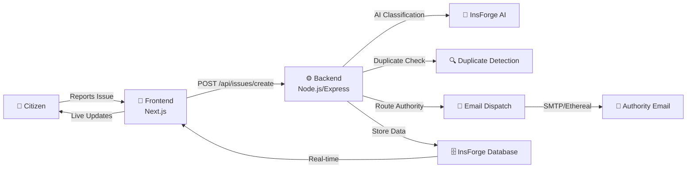
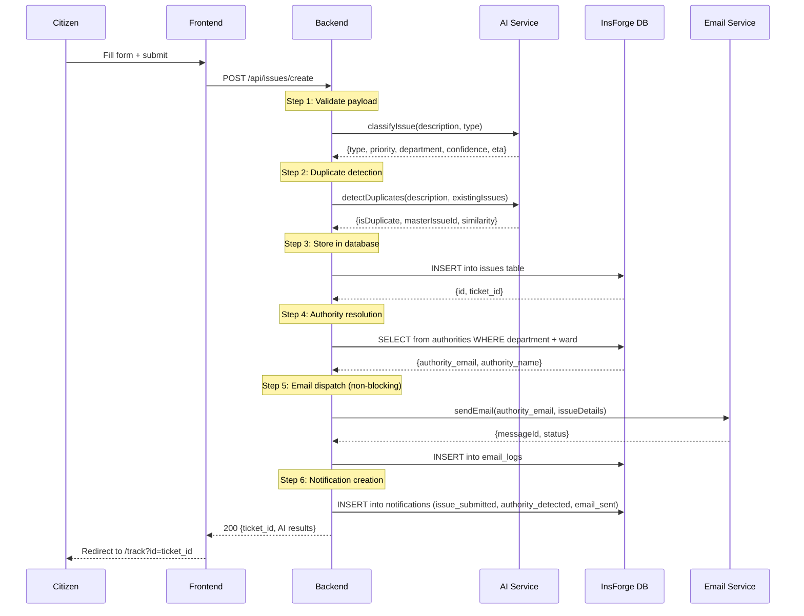
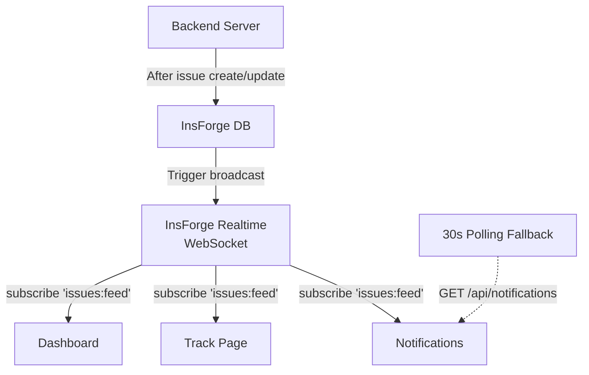

# Issue2Action — Full Platform Walkthrough

## 1. Overview

**Issue2Action** is a full-stack AI-powered civic issue management platform that enables citizens to report municipal problems (potholes, water leaks, garbage dumping, broken streetlights) and have them automatically classified, routed to the correct authority, and tracked in real-time.



---

## 2. Technology Stack

| Layer | Technology | Purpose |
|---|---|---|
| **Frontend** | Next.js 16 (App Router) | Pages, routing, SSR |
| **UI** | Tailwind CSS 3.4 + Framer Motion | Styling, animations |
| **Backend** | Node.js + Express | API server, pipeline orchestration |
| **Database** | InsForge (PostgreSQL) | Data persistence, real-time subscriptions |
| **Auth** | InsForge Auth SDK | Email/password + Google OAuth + OTP verification |
| **AI** | InsForge AI (OpenAI-compatible) | Issue classification, duplicate detection |
| **Email** | Nodemailer (Ethereal/SMTP) | Authority notification dispatch |
| **Maps** | Leaflet + React-Leaflet | Geolocation, issue visualization |
| **State** | SWR + React Context | Data fetching, caching, global state |

---

## 3. Project Structure

```
issue2action/
├── backend/                          # Node.js API server
│   ├── server.js                     # Main server (1099 lines) — all API routes
│   ├── aiService.js                  # AI classification + duplicate detection
│   ├── emailService.js               # SMTP email dispatch with retry logic
│   ├── logger.js                     # Structured logging for real-time monitoring
│   └── .env                          # INSFORGE_BASE_URL, INSFORGE_ANON_KEY, SMTP config
│
├── issue2action2/my-app/             # Next.js frontend
│   ├── app/
│   │   ├── page.tsx                  # Landing page (/)
│   │   ├── login/page.tsx            # Auth (sign in / sign up / OTP)
│   │   ├── dashboard/page.tsx        # Impact stats dashboard
│   │   ├── report/page.tsx           # Issue reporting form
│   │   ├── track/page.tsx            # Live issue tracking
│   │   ├── my-reports/page.tsx       # User's submitted reports
│   │   ├── map/page.tsx              # Full-screen issue map
│   │   ├── notifications/page.tsx    # Notification center
│   │   ├── admin/page.tsx            # AI Insights & analytics
│   │   ├── admin/authorities/        # Authority management
│   │   ├── help/page.tsx             # FAQ & support chat
│   │   ├── demo/page.tsx             # Live demo mode
│   │   └── actions/                  # Server actions (classifyIssue, detectDuplicates)
│   ├── components/
│   │   ├── layout/ (Sidebar, Navbar, DashboardLayout, NotificationBell)
│   │   ├── auth/ (AuthProvider, AuthGuard, GuestGuard)
│   │   ├── ui/ (Logo, Badge, Toast)
│   │   ├── MapView.tsx               # Leaflet map with color-coded markers
│   │   ├── StatusBadge.tsx           # Status indicator component
│   │   └── ThemeToggle.tsx           # Dark/light mode switcher
│   ├── lib/
│   │   ├── api.ts                    # API client (fetcher, CRUD functions)
│   │   ├── auth.ts                   # Token management (saveAuth, getAuth)
│   │   ├── insforge.ts              # InsForge SDK client initialization
│   │   └── types.ts                  # TypeScript interfaces
│   └── store/
│       └── AppContext.tsx            # Global React context
│
└── demo/
    └── live-demo.html                # Standalone demo page (HTML)
```

---

## 4. Page-by-Page Walkthrough

### 4.1 Landing Page (`/`)
[page.tsx](file:///c:/Users/JEET%20DUTTA/Downloads/issue2action/issue2action2/my-app/app/page.tsx)

The premium landing page with:
- **Animated gradient mesh** background with parallax scrolling
- **Hero section** — "Transform Your Civic Voice Into Immediate Action"
- **Feature cards** — AI Classification, Image Analysis, Real-time Tracking, Smart Routing
- **Social proof** — animated counters and trust badges
- **CTA** — "Get Started" linking to dashboard

> [!TIP]
> Uses Framer Motion `useScroll` + `useTransform` for parallax orbs

---

### 4.2 Authentication (`/login`)
[page.tsx](file:///c:/Users/JEET%20DUTTA/Downloads/issue2action/issue2action2/my-app/app/login/page.tsx)

Split-tab auth form supporting three flows:

| Flow | Mechanism |
|---|---|
| **Sign In** | InsForge `auth.signInWithPassword()` |
| **Sign Up** | InsForge `auth.signUp()` → 6-digit email OTP verification |
| **Google OAuth** | InsForge `auth.signInWithOAuth({ provider: 'google' })` |

**Key features:**
- `GuestGuard` wrapper — auto-redirects authenticated users to `/dashboard`
- City/Ward field collected during signup for community routing
- 6-digit OTP input with auto-advance, paste support, and auto-submit on completion
- Glassmorphic card with ambient glow background

---

### 4.3 Dashboard (`/dashboard`)
[page.tsx](file:///c:/Users/JEET%20DUTTA/Downloads/issue2action/issue2action2/my-app/app/dashboard/page.tsx)

The main analytics hub showing:

**Stats Cards (4):**
- Pending Action (amber) — reported/verified/assigned count
- In Progress (blue) — active work count
- Total Resolved (green) — resolved/closed count
- Resolution Rate (indigo) — percentage

**Issues Transformed** — horizontal bar chart grouped by issue type (Road, Water, Garbage, etc.)

**Community Reach** — spinning orbital gradient circle showing total report count

**Live City Feed** — horizontally scrollable cards of the 4 most recent issues with status badges, ward tags, and "Authority Notified" indicators

**Real-time updates** via InsForge `realtime.subscribe('issues:feed')` — dashboard auto-refreshes when new data arrives.

**Filters:** Time (All/Today/Week/Month), Status, Category

---

### 4.4 Report Issue (`/report`)
[page.tsx](file:///c:/Users/JEET%20DUTTA/Downloads/issue2action/issue2action2/my-app/app/report/page.tsx)

Multi-step form for civic issue submission:

| Field | Details |
|---|---|
| **Description** | Free-text issue description (required, min 20 chars) |
| **Location** | Auto-detected via GPS + Nominatim reverse geocoding, or manual input |
| **Ward/Area** | Text input for municipal ward identification |
| **Issue Type** | Dropdown: Road Damage, Water Leak, Garbage, Streetlights, Sewer, Other |
| **Images** | Up to 5 images, uploaded to InsForge Storage, with preview thumbnails |

**Submission flow:**
1. Frontend validates all fields
2. Images uploaded to InsForge Storage → URLs collected
3. `POST /api/issues/create` with full payload
4. Backend returns ticket ID → redirect to `/track?id={ticketId}`

---

### 4.5 Live Tracking (`/track`)
[page.tsx](file:///c:/Users/JEET%20DUTTA/Downloads/issue2action/issue2action2/my-app/app/track/page.tsx)

Two-column tracking interface:

**Left Column:**
- **Status Progress Bar** — 4 stages with animated fill:
  1. Email Sent ✅
  2. Reminder Sent ⏰
  3. Escalated ⚠️
  4. Resolved ✅
- **Communication Panel** — Chat-style message thread between citizen and authority
  - User can type replies → `POST /api/issues/{id}/reply`
  - System messages for status updates, email dispatch confirmations
  - Optimistic UI with rollback on failure

**Right Column:**
- **Live Map** — Leaflet map with all community issues as color-coded markers
  - "Tracking Live" indicator with pulsing red dot
  - Live Mode toggle (ON/OFF) for real-time InsForge subscription
  - Auto-centers on the tracked issue
- **Issue Insight Card** — Priority, type, severity, estimated resolution time

---

### 4.6 My Reports (`/my-reports`)
[page.tsx](file:///c:/Users/JEET%20DUTTA/Downloads/issue2action/issue2action2/my-app/app/my-reports/page.tsx)

Personal issue management page:
- Fetches user-specific issues via `getUserIssues(userId)`
- **Search bar** — filter by title, ID, or description
- **Status filter** — dropdown for reported/verified/assigned/in_progress/resolved/closed
- **Category filter** — auto-populated from user's issue types
- Each report card shows: StatusBadge, Ticket ID, dispatch status, location, "TRACK PROGRESS" CTA
- "New Report" button → `/report`

---

### 4.7 Live Map (`/map`)
[page.tsx](file:///c:/Users/JEET%20DUTTA/Downloads/issue2action/issue2action2/my-app/app/map/page.tsx)

Full-screen split-view map:
- **Sidebar (320px)** — issue list with category filters (All/Road/Water/Garbage/Electric/Lights)
- **Map (remaining width)** — Leaflet map with all community issues
- **Interaction:** Click an issue in the sidebar → map centers on it with highlight
- Color-coded markers by priority (critical=red, high=orange, medium=yellow, low=green)
- Time-ago timestamps and upvote counts on each card

---

### 4.8 Notifications (`/notifications`)
[page.tsx](file:///c:/Users/JEET%20DUTTA/Downloads/issue2action/issue2action2/my-app/app/notifications/page.tsx)

Notification center with:
- **6 notification types** — each with unique icon, color, and label:
  - `issue_submitted` (emerald), `authority_detected` (amber), `email_sent` (blue)
  - `issue_escalated` (red), `issue_resolved` (green), `status_update` (indigo)
- **Filter pills** — All, Unread, by type
- **Mark as read** — click individual or "Mark all as read" button
- **Real-time** — InsForge subscription + 30s polling fallback
- **Staggered fade-in animation** on render
- Unread indicator: left gradient border bar + pulsing blue dot

---

### 4.9 AI Insights & Admin (`/admin`)
[page.tsx](file:///c:/Users/JEET%20DUTTA/Downloads/issue2action/issue2action2/my-app/app/admin/page.tsx)

Admin analytics dashboard pulling **real data** from InsForge:

**6 Stat Cards:** Total Reports, Resolution Rate, Critical Issues, Active Citizens, Emails Sent, Avg Fix Time

**Issue Categories & Resolution** — bar chart showing each category's resolved percentage

**Email Escalation Breakdown** — tiered escalation display:
- Level 0: Initial Dispatch
- Level 1: Follow-up
- Level 2: District Authority
- Level 3: State Authority

---

### 4.10 Help & FAQ (`/help`)
[page.tsx](file:///c:/Users/JEET%20DUTTA/Downloads/issue2action/issue2action2/my-app/app/help/page.tsx)

- **7 FAQ items** with animated CSS Grid accordion
- **"Start Live Chat"** CTA → opens support modal → sends message via `sendSupportMessage()` API
- Gradient blue/indigo contact card with glass-effect background

---

### 4.11 Live Demo (`/demo`)
[page.tsx](file:///c:/Users/JEET%20DUTTA/Downloads/issue2action/issue2action2/my-app/app/demo/page.tsx)

Split-screen presentation tool:

| Left Panel | Right Panel |
|---|---|
| Website iframe (`/report` → `/track`) | Real-time backend log terminal |

**Pipeline bar (6 steps):** Issue Submitted → Backend Received → AI Classification → Authority Routed → Email Dispatched → Status Updated

Each step auto-activates based on **real log detection** from `/api/admin/logs`.

---

## 5. Backend Pipeline — The Core Workflow

The entire E2E flow is orchestrated by [server.js](file:///c:/Users/JEET%20DUTTA/Downloads/issue2action/backend/server.js):



### Backend API Endpoints

| Method | Route | Purpose |
|---|---|---|
| `POST` | `/api/issues/create` | Create issue + full AI pipeline |
| `GET` | `/api/issues/public` | Public issue feed (with filters) |
| `GET` | `/api/issues/:id` | Single issue with timeline |
| `GET` | `/api/issues/user/:userId` | User's reported issues |
| `POST` | `/api/issues/:id/reply` | Add communication message |
| `GET` | `/api/notifications/:userId` | User notifications |
| `PUT` | `/api/notifications/:id/read` | Mark notification read |
| `PUT` | `/api/notifications/:userId/read-all` | Mark all read |
| `GET` | `/api/admin/logs` | Backend log stream (polling) |
| `GET` | `/api/health` | Server health check |
| `POST` | `/api/auth/register` | User registration sync |
| `POST` | `/api/auth/login` | User login |
| `POST` | `/api/support/message` | Help desk message |

---

## 6. AI Service Pipeline

[aiService.js](file:///c:/Users/JEET%20DUTTA/Downloads/issue2action/backend/aiService.js) powers two core AI operations:

### Issue Classification
```
Input:  "Large pothole near Gariahat Road, 3 feet wide"
Output: {
  type: "Road Damage",
  priority: "high",
  department: "Public Works Department",
  confidence: 94,
  eta: "24-48 hours",
  summary: "Severe road damage requiring urgent repair"
}
```

### Duplicate Detection
```
Input:  New description + array of existing issues
Output: {
  is_duplicate: true/false,
  master_issue_id: "abc123",
  similarity_score: 0.87,
  similar_count: 3
}
```

---

## 7. Email Dispatch System

[emailService.js](file:///c:/Users/JEET%20DUTTA/Downloads/issue2action/backend/emailService.js):

- **Transport:** SMTP (prod) or Ethereal test accounts (dev fallback)
- **retry logic** with configurable attempts
- **Email logs** stored in `email_logs` table with escalation_level tracking
- **Escalation ladder:**
  - Level 0: Initial dispatch to ward-level authority
  - Level 1: Follow-up reminder
  - Level 2: District-level escalation
  - Level 3: State-level authority

---

## 8. Navigation Structure

The sidebar ([Sidebar.tsx](file:///c:/Users/JEET%20DUTTA/Downloads/issue2action/issue2action2/my-app/components/layout/Sidebar.tsx)) provides:

```
📊 Home → /dashboard
📝 Report Issue → /report
📋 My Reports → /my-reports
🗺️ Live Map → /map
🛡️ Authorities (Admin) → /admin/authorities
🔔 Notifications → /notifications
```

Plus:
- **Trending Issues** section — auto-populated from API showing top 3 issue types with counts
- **User profile** at bottom — avatar initial, name, email, logout button
- **Active route highlight** — purple/white shimmer on current page

---

## 9. Database Schema

Key tables in InsForge (PostgreSQL):

| Table | Purpose |
|---|---|
| `issues` | All reported civic issues with AI classification data |
| `users` | Registered citizens with city/ward info |
| `timeline` | Status change history per issue |
| `authorities` | Municipal authority contacts by department/ward |
| `email_logs` | Email dispatch records with escalation levels |
| `notifications` | In-app notification records per user |
| `support_messages` | Help desk messages |

---

## 10. Real-Time Architecture



---

## 11. How to Run

```bash
# Terminal 1 — Backend (port 3001)
cd backend
npm install
node server.js

# Terminal 2 — Frontend (port 3000)  
cd issue2action2/my-app
npm install
npm run dev

# Terminal 3 (optional) — Open browser
open http://localhost:3000         # Landing page
open http://localhost:3000/demo    # Live demo mode
```

### Environment Variables

**Backend (`backend/.env`):**
```env
INSFORGE_BASE_URL=https://your-app.region.insforge.app
INSFORGE_ANON_KEY=your-anon-key
SMTP_HOST=smtp.ethereal.email      # Or your SMTP server
SMTP_USER=your-email
SMTP_PASS=your-password
```

**Frontend (`my-app/.env.local`):**
```env
NEXT_PUBLIC_API_URL=http://localhost:3001
NEXT_PUBLIC_INSFORGE_URL=https://your-app.region.insforge.app
NEXT_PUBLIC_INSFORGE_ANON_KEY=your-anon-key
```

---

## 12. Key Design Decisions

| Decision | Rationale |
|---|---|
| **Non-blocking email dispatch** | API returns ticket ID immediately; email sends asynchronously so the user isn't blocked |
| **Graceful fallbacks** | Ethereal test SMTP if prod not configured; default admin email if authority not found |
| **Optimistic UI** | Chat messages appear instantly; rolled back on failure |
| **Dual real-time strategy** | InsForge WebSocket primary + 30s polling fallback for reliability |
| **AI confidence thresholds** | Classification results include confidence % to enable manual review when low |
| **Structured logging** | Custom `logger.js` enables the live demo to parse and display pipeline steps in real-time |
| **Duplicate merging** | Similar reports are linked to a master issue, boosting priority automatically |
